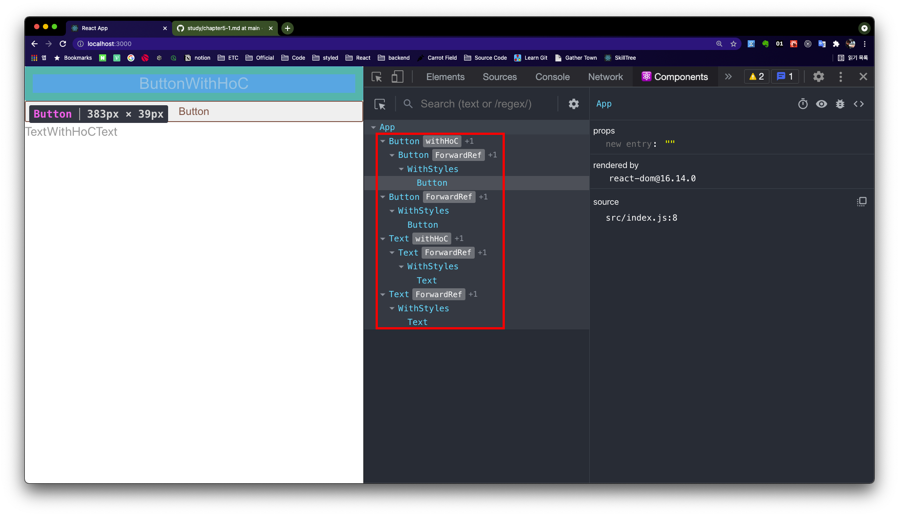
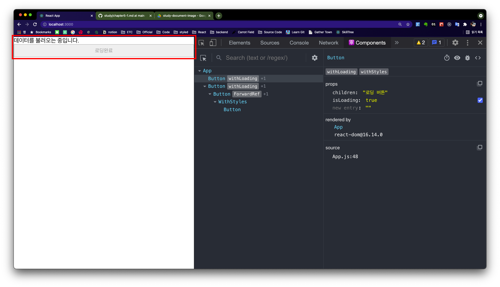

# 하이어오더 컴포넌트 기초 개념 공부하기

> 디자인 패턴은 코드 중 활용도가 높은 구현 방식을 모아둔 비밀 레시피와 같습니다. 여러분이 작성한 코드의 구조를 더 견고하고, 손쉽게 재활용할 수 있게 해줍니다. 앞에서 공부한 커링도 디자인 패턴의 일종입니다. 리액트 컴포넌트에도 디자인 패턴을 적용할 수 있습니다. 이번에 알아볼 디자인 패턴은 데코레이터 패턴이며, 이후 데코레이터 패턴을 적용항여 하이어오더 컴포넌트까지 개념을 확장해 보겠습니다.

## 상속 패턴보다 데코레이터 패턴이 필요한 이유

데코레이터 패턴을 이해하려면 먼저 상속 패턴과 상속 패턴의 단점을 알아야 합니다.

- 상속 패턴은 **공통 기능은 부모로부터 물려받고, 추가 기능만 구현하여 중복 코드의 양을 줄일 수 있다**는 장점이 있습니다.
- 하지만 **여러 부모의 속성을 동시에 가질 경우** 많은 문제점이 발생합니다.

<br>

---

## 데코레이터 패턴 알아보기

> 데코레이터 패턴은 클래스 간의 종속성 없이 기능만을 공유합니다.

<br>

---

## 하이어오더 컴포넌트의 개념 알아보기

### 1. 하이어오더 컴포넌트는 함수나 클래스 형태의 컴포넌트를 모두 반환할 수 있습니다.

하이어오더 컴포넌트는 기존 컴포넌트에 기능을 덧입혀 새 컴포넌트로 반환하는 함수를 말합니다. 보통 하이어오더 컴포넌트가 반환하는 컴포넌트를 확장 컴포넌트라 부릅니다. 다음은 하이어오더 컴포넌트가 두 가지 형태로 확장 컴포넌트를 반환하는 모습입니다.

```js
// 함수형 컴포넌트를 반환하는 hoc
function higherOrderComponent(Component) {
  return function Enhanced(props) {
    return <Component {...props} />;
  };
}

// 클래스형 컴포넌트를 반환하는 hoc
function higherOrderComponent(Component) {
  return class Enhanced extends React.Component {
    render() {
      return <Component {...this.props} />;
    }
  };
}
```

- 확장 컴포넌트의 형태는 개발자가 직접 결정하면 됩니다. 보통은 '생명주기 함수를 확장한 hoc를 구성해야 하는 경우' 클래스형 컴포넌트를 반환하도록 구현합니다.
- hoc는 기존 컴포넌트에 연결된 프로퍼티를 모두 전달해 주어야 합니다.
  - hoc 컴포넌트는 기존 컴포넌트를 확장한 컴포넌트이므로 기존 컴포넌트로 모든 프로퍼티를 전달해 주어야 합니다.
- hoc와 확장 컴포넌트의 이름은 with로 시작합니다.
  - 리액트 개발자들은 암묵적으로 hoc와 확장 컴포넌트의 이름에 with를 붙입니다.

<br>

---

## 하이어오더 컴포넌트 간단하게 사용해 보기

hoc를 구현하여 확장 컴포넌트를 생성해 보겠습니다.

```js
// ./src/05/withHoC.jsx

import React from "react";

export default function withHoC(WrappedComponent) {
  return class WithHoc extends React.Component {
    render() {
      return <WrappedComponent {...this.props} />;
    }
  };
}
```

- hoc는 `<WrappedComponent>`를 인자로 받습니다. 이 인자가 기존의 컴포넌트 또는 재활용할 컴포넌트 입니다.
- `{... this.props}`를 이용하여 기존 컴포넌트의 프로퍼티를 확장 컴포넌트에 전달합니다.

<br>

### 1. 확장 컴포넌트 생성하기

위에서 만든 `withHoC()`의 인자로 4장에서 만든 Button, Text 컴포넌트를 전달하여 확장된 컴포넌트를 생성합니다.

```js
// App.js

import React from "react";
import Button from "../04/Button";
import Text from "../04/Text";
import withHoC from "../05/withHoC";

const ButtonWithHoC = withHoC(Button);
const TextWithHoC = withHoC(Text);

export default function App() {
  return (
    <>
      <ButtonWithHoC primary large>
        ButtonWithHoC
      </ButtonWithHoC>
      <TextWithHoC secondary small>
        TextWithHoC
      </TextWithHoC>
    </>
  );
}
```

<br>

---

## 하이어오더 컴포넌트 구조 살펴보기

리액트 크롬 확장 플러그인에 있는 Components 탭을 확인하면 withHoC를 통해 출력된 컴포넌트의 계층 구조를 쉽게 확인할 수 있습니다.



- hoc를 사용하여 출력한 컴포넌트와 일반 컴포넌트의 계층 구조를 비교할 수 있습니다.

<br>

---

## 하이어오더 컴포넌트 기능 구현하기

이번에는 하이어오더 컴포넌트를 이용하여 실무에서 자주 사용하는 '로딩 상태 표시 컴포넌트'를 만들어 보겠습니다.

### 1. 로딩 표시 화면 하이어오더 컴포넌트 만들기

일단 하이어오더 컴포넌트 구조를 완성합니다.

```js
// .src/05/withLoading.jsx

import React from "react";

export default function withLoding(WrappedComponent) {
  const { displayName, name: componentName } = WrappedCoamponent;
  const wrappedComponentName = displayName || componentName;

  function WithLoading(props) {
    return <WrappedComponent {...props} />;
  }
  WithLoading.displayName = `withLoading(${wrappedComponentName})`;
  return WithLoading;
}
```

- WrappedComponent의 displayName과 name을 추출합니다.
- displayName, name 순서로 이름을 할당합니다.
- `withLoading()`에 감싸 컴포넌트 이름을 표시합니다.

### 2. isLoading 프로퍼티 조건 추가하기

withLoading 컴포넌트를 수정하여 '로딩중' 메시지를 출력하도록 만들어 보겠습니다. isLoading 프로퍼티값이 있으면 '로딩중' 메시지를 표시합니다.

```js
// ./src/05/withLoading.jsx

import React from "react";

export default function withLoding(WrappedComponent) {
  const { displayName, name: componentName } = WrappedCoamponent;
  const wrappedComponentName = displayName || componentName;

  function WithLoading(props) {
    if (props.isLoading) return "Loading";
    return <WrappedComponent {...props} />;
  }
  WithLoading.displayName = `withLoading(${wrappedComponentName})`;
  return WithLoading;
}
```

### 3. 필요한 프로퍼티만 구조 할당 표현식으로 추출하기

isLoading 프로퍼티는 로딩 표시 기능을 추가할 때만 필요합니다. 즉, 확장 컴포넌트에는 필요하지 않으므로 구조 할당 표현식으로 isLoading을 제외하여 확장 컴포넌트에 전달합니다.

```js
import React from "react";

export default function withLoding(WrappedComponent) {
  const { displayName, name: componentName } = WrappedCoamponent;
  const wrappedComponentName = displayName || componentName;

  function WithLoading({ isLoading, ...otherProps }) {
    if (isLoading) return "Loading";
    return <WrappedComponent {...otherProps} />;
  }
  WithLoading.displayName = `withLoading(${wrappedComponentName})`;
  return WithLoading;
}
```

- isLoading 프로퍼티를 구조 할당 표현식으로 추출하고 나머지 프로퍼티는 `...otherProps`에 넣어 확장 컴포넌트에 전달합니다.

### 4. 로딩 메시지 다양하게 변경하기

로딩 메시지를 다양하게 출력하려면 어떻게 해야 할까요? 이런 경우 하이어오더 컴포넌트의 loadingMessage라는 매개변수를 추가하여 하이어오더 컴포넌트를 생성할 때 인자로 로딩 메시지를 전달받는 방법을 사용할 수 있습니다.

```js
// .src/05/withLoading.jsx

import React from "react";

export default function withLoding(
  WrappedComponent,
  loadingMessage = "Loading"
) {
  const { displayName, name: componentName } = WrappedCoamponent;
  const wrappedComponentName = displayName || componentName;

  function WithLoading({ isLoading, ...otherProps }) {
    if (isLoading) return loadingMessage;
    return <WrappedComponent {...otherProps} />;
  }
  WithLoading.displayName = `withLoading(${wrappedComponentName})`;
  return WithLoading;
}
```

- 하이어오더 컴포넌트에 loadingMessage라는 매개변수를 기본값과 함께 추가했습니다.
- 그러나 하이어오더 컴포넌트를 만들 때는 암묵적으로 **컴포넌트 인자 하나만 전달한다** 라는 규칙이 있습니다.
- 규칙을 어기지 않도록 다른 구현 방법을 사용해 봅시다.

### 5. 다중 커링으로 하이어오더 컴포넌트 반환하기

위 같은 경우 **다중 커링**을 활용하면 됩니다. 첫 번째 커링 함수를 통해 출력 메시지를 전달받아 하이어오더 컴포넌트 내부에 전달하면 하이어오더 컴포넌트의 인자 규칙을 지킬 수 있습니다.

```js
// .src/05/withLoading.jsx

import React from "react";

export default function (loadingMessage = "Loading") {
  return function withLoading(WrappedComponent) {
    const { displayName, name: componentName } = WrappedCoamponent;
    const wrappedComponentName = displayName || componentName;

    function WithLoading({ isLoading, ...otherProps }) {
      if (isLoading) return loadingMessage;
      return <WrappedComponent {...otherProps} />;
    }

    WithLoading.displayName = `withLoading(${wrappedComponentName})`;
    return WithLoading;
  };
}
```

- 기존 withLoading 함수를 감싸는 익명함수는 확장 컴포넌트에서 출력할 메시지를 전달받는 커링 함수입니다.

### 6. 테스트 출력 해보기

```js
// App.js

import React from "react";
import Button from "../04/Button";
import Text from "../04/Text";
import withLoading from "../05/withLoading";

const ButtonWithLoading = withLoading("데이터를 불러오는 중입니다.")(Button);

export default function App() {
  return (
    <>
      <ButtonWithLoading isLoading>로딩중</ButtonWithLoading>
      <ButtonWithLoading>로딩완료</ButtonWithLoading>
    </>
  );
}
```

- isLoading 프로퍼티를 전달한 확장 컴포넌트와 그렇지 않은 확장 컴포넌트를 동시에 출력해 비교해 봅니다.



- isLoading 프로퍼티를 전달한 컴포넌트는 커링으로 전달한 loadingMessage를 출력하고 있습니다.
