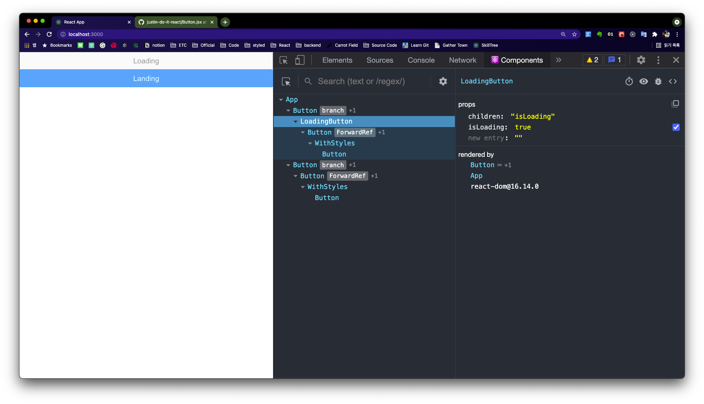
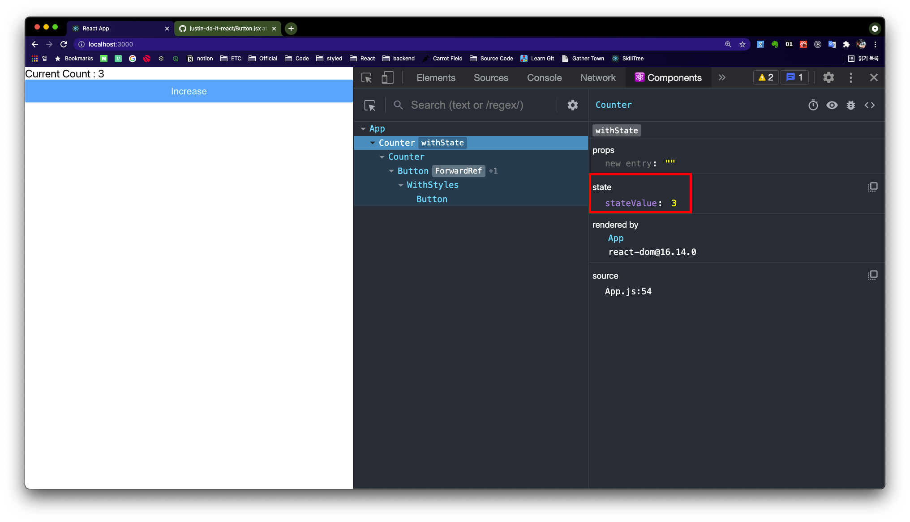
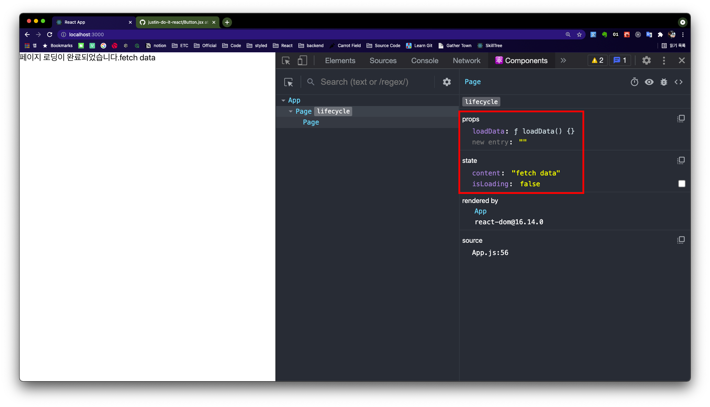

# 5-3 하이어오더 컴포넌트 라이브러리 사용하기

> recompose 라이브러리는 하이어오더 컴포넌트 중 자주 사용하는 패턴을 모은 '하이어오더 컴포넌트 라이브러리' 입니다. 리액트 16.8 버전부터는 대부분의 recompose 기능이 리액트 훅에 구현되어 있습니다. 그럼에도 recompose의 활용 방법을 알아야 하는 이유는 함수형 컴포넌틍의 기능을 확장하는 방법을 이해하는 데 도움이 되기 때문입니다.

## recompose 라이브러리 설치하고 임포트하기

```bash
> yarn add recompose
```

recompose의 모든 함수들을 임포트하면 프로젝트가 무거워지므로 다음과 같이 필요한 함수만 추출하여 임포트 하는 것이 좋습니다. <br>
with라는 단어가 붙은 기능은 **하이어오더 컴포넌트**의 역할을 합니다.

```js
// import example

// 비효율적인 패키지 참조 방법
import { branch, withState } from "recompose";

// 효율적인 패키지 참조 방법
import branch from "recompose/branch";
import withState from "recompose/withState";
```

<br>

---

## branch() 함수로 조건에 따라 다른 컴포넌트 출력하기

`branch()` 함수는 조건식에 따라 다른 하이어오더 컴포넌트를 출력해야 하는 경우 사용하면 됩니다. 다음은 기본 사용법입니다.

```js
branch(
  (condition: (props) => boolean),
  (left: HigherOrderComponent),
  [(right: HigherOrderComponent)] // 생략할 수 있습니다.
)(WrappedComponent);
```

- condition은 출력 조건을 정의한 함수입니다.
- left는 출력 조건 함수가 true일 때 출력될 컴포넌트를 반환하는 함수 입니다.
- right는 출력 조건 함수가 false일 때 출력될 컴포넌트를 반환하는 함수 입니다.
- condition으로 전달받은 콜백 함수가 반환하는 값에 따라 left, right 함수의 실행 결과 컴포넌트를 출력합니다.
- right는 생략할 수 있으며, 생략된 경우 WrappedComponent를 그대로 출력합니다.

<br>

### 1. `branch()` 함수로 로딩 상태 표시 하이어오더 컴포넌트 만들기

```js
// ./src/05/branch.jsx

import React from "react";
import branch from "recompose/branch";
import Button from "../04/Button";

function isLoading(props) {
  return props.isLoading;
}

function LoadingButton(props) {
  return <Button disabled>Loading</Button>;
}

export default branch(isLoading, () => LoadingButton)(Button);
```

- `branch()` 함수를 이용하여 앞서 작성한 로딩 상태 표시 하잉어오더 컴포넌트를 구현합니다.
- `isLoading()` 함수에서 받은 프로퍼티값 `props.isLoading`이 true 이면 LoadidngButton 컴포넌트를, false이면 기존 Button 컴포넌트를 그대로 출력합니다.

`App.js`에서 임포트 한 뒤 테스트 화면을 출력합니다.

```js
// App.js

import React from "react";
import BranchLoadidngButton from "../05/branch";

export default function App() {
  return (
    <>
      <BranchLoadingButton isLoading>로딩중</BranchLoadingButton>
      <BranchLoadingButton primary>Landing</BranchLoadingButton>
    </>
  );
}
```



- `isLoading` 프로퍼티를 전달받은 첫 번째 버튼 컴포넌트는 Loading 메시지를 출력하는 것을 확인할 수 있습니다.

<br>

---

## `withState()` 함수로 상태 관리와 이벤트 처리하기

> 리액트 useState hooks로 함수형 컴포넌트에서도 state를 통한 상태관리가 가능합니다. 아래 내용은 레거시가 되었지만 hooks 이전의 코드를 통해 state hooks의 구현 방식에 대해 알아볼 수 있습니다.

`withState()` 함수는 함수형 컴포넌트를 클래스형 컴포넌트로 변환하지 않아도 state를 사용할 수 있게 해줍니다.

```js
withState(
  (stateName: string),
  (stateUpdater: string),
  (initialState: any)
)(WrappedComponent);
```

- `stateName`은 state를 전달할 프로퍼티 이름입니다.
- `stateUpdater`는 state를 변경할 수 있는 콜백 함수 프로퍼티 이름입니다.
- `initialState`는 state의 초기값입니다.

### 1. `withState()` 함수 사용하여 카운트를 관리하는 state 구현하기

```js
import React from "react";
import withState from "recompose/withState";
import Button from "../04/Button";

export const withCountState = withState("count", "setCount", 0);

function Counter({ count, setCount }) {
  const increaseCount = () => setCount((value) => value + 1);

  return (
    <div>
      Current Count : {count}
      <Button primary onPress={increaseCount}>
        Increase
      </Button>
    </div>
  );
}

export const CounterWithCountState = withCountState(Counter);
```

- `withState()` 함수를 이용하여 count, setCount state를 생성하고 초기값으로 0을 설정하였습니다.
- `withCountState()`함수를 export 하면 설정값이 갖춰진 하이어오더 컴포넌트 생성 함수가 자동으로 만들어 집니다.
- 이 함수의 인자로 컴포넌트를 전달하면 컴포넌트에 state값과 state값을 변경할 수 있는 함수, 초기값이 전달됩니다.

`App.js`에 import 하여 실행시키면 다음과 같이 동작하는 것을 확인할 수 있습니다.


- Increase 버튼을 클릭하면 `setCount` 함수를 리턴하는 `IncreaseCount` 함수가 동작하여 Counter 컴포넌트의 state값을 변경하는 것을 확인할 수 있습니다.

<br>
___

## `lifecycle()` 함수로 함수형 컴포넌트에 생명주기 함수 추가하기

함수형 컴포넌트에도 생명주기 함수를 적용하고 싶다면 `lifecycle()` 함수를 사용하면 됩니다. `lifecycle()` 함수의 기본 구조는 아래와 같습니다.

```js
lifecycle({
    [lifeCycleMethod: string]: function,
    state: object,
})(WrappedComponent)
```

- `lifeCycleMethod`에는 생명주기 함수 이름을, `state`에는 state의 초기값을 입력합니다.
- `lifecycle()` 생성 함수는 `this.props`에 접근할 수 있으므로 커링을 통해 프로퍼티 인자를 따로 전달받지 않아도 됩니다.
  - 하지만 이런 특성 때문에 `lifecycle()` 함수에는 화살표 함수 표현식을 사용할 수 없습니다.
  - 화살표 함수는 `this`의 범위가 선언된 구문의 범위로 고정되기 때문입니다.
- 함수 내부에는 생명주기 함수 이름 이외에 state의 초기값을 설정할 수 있는 state 키워드를 제공ㅎ압니다.
- `setState()` 함수로 설정된 state 값은 WrappedComponent에 프로퍼티로 변환되어 전달됩니다.

### 1. `lifecycle()` 함수로 최초 생성시 데이터 요청하기

다음은 `lifecycle()` 함수로 기존의 서버 데이터를 호출하는 예제입니다.

```js
// .src/05/lifecycle.jsx

import React from "react";
import lifecycle from "recompose/lifecycle";

function Page({ content }) {
  return (
    <div>
      페이지 로딩이 완료되었습니다.
      {content}
    </div>
  );
}

export const withLoadData = lifecycle({
  state: { isLoading: true, content: "" },
  componentDidMount: function () {
    if (this.props.loadData) {
      this.props
        .loadData()
        .then((content) => this.setState({ isLoading: false, content }));
    }
  },
});

export const PageWithLoadData = withLoadData(Page);
```

`App.js`에서 import 후 loadData 프로퍼티로 fetch 함수를 전달합니다.

```js
// App.js

import React from "react";
import { PageWithLoadData } from "./05/lifecycle.jsx";

export default function App() {
  return (
    <PageWithLoadData loadData={() => fetch("/").then(() => "fetch data")} />
  );
}
```



- props로 전달된 loadData 함수를 확인할 수 있습니다.
- componentDidMount 생명주기 단계에서 props로 전달받은 loadData가 동작한 후 state에 데이터가 저장된 것을 확인할 수 있습니다.
